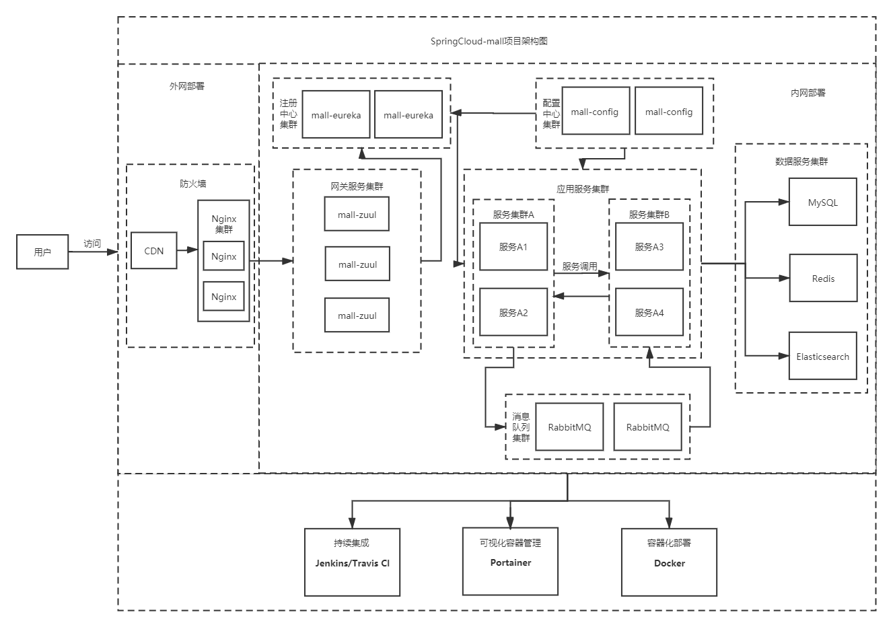

# SpringCloud-mall

##### 巢庭万家SpringCloud项目

此项目是SpringCloud-Hoxton+Vue+Element开发的项目。

> 注意，这个是4个人的团队练习项目，并非传统意义上的开源项目，如果你需要和小伙伴一起练习SpringCloud开发，这个项目也许能帮到你！

[]() [](https://github.com/besscroft/SpringCloud-mall/blob/master/LICENSE) []()

### 项目介绍

`SpringCloud-mall`是一套微服务商城系统，采用了 SpringCloud-Hoxton、Spring Boot 2.3、MyBatis、Docker、Elasticsearch等核心技术，同时提供了基于Vue的管理后台和用户前台方便快速搭建系统。`SpringCloud-mall`在电商业务的基础集成了注册中心、配置中心、网关、消息队列等系统功能。

## 系统架构图



## 组织结构（服务太多，不想细写了）

``` lua
mall
├── mall-common -- 工具类及通用代码模块
├── mall-static -- 页面资源和静态资源（前端）
├── mall-auth -- 基于Spring Security Oauth2的统一的认证中心
├── mall-zuul -- 基于zuul的微服务API网关服务
├── mall-admin -- 后台管理系统服务（按实际情况更改，--根文件夹，不用写出来）
	├── mall-admin-product -- 后台商品模块
	├── mall-admin-order -- 后台订单模块
	├── mall-admin-security -- 后台权限模块
	├── mall-admin-auth -- 统一验证模块
├── mall-search -- 基于Elasticsearch的商品搜索系统服务
├── mall-web -- Web商城系统服务（按实际情况更改，--根文件夹，不用写出来）
	├── mall-web-*** -- 前台***模块
└── config -- 配置中心存储的配置
```

## 技术选型

### 后端技术

| 技术                   | 说明                 | 官网                                             |
| ---------------------- | -------------------- | ------------------------------------------------ |
| Spring Cloud           | 微服务框架           | https://spring.io/projects/spring-cloud          |
| Spring Boot            | 容器+MVC框架         | https://spring.io/projects/spring-boot           |
| Spring Security Oauth2 | 认证和授权框架       | https://spring.io/projects/spring-security-oauth |
| MyBatis                | ORM框架              | http://www.mybatis.org/mybatis-3/zh/index.html   |
| PageHelper             | MyBatis物理分页插件  | http://git.oschina.net/free/Mybatis_PageHelper   |
| Swagger2               | 文档生产工具         | https://swagger.io/                              |
| Elasticsearch          | 搜索引擎             | https://github.com/elastic/elasticsearch         |
| RabbitMQ               | 消息队列             | https://www.rabbitmq.com/                        |
| Redis                  | 分布式缓存           | https://redis.io/                                |
| Docker                 | 应用容器引擎         | https://www.docker.com/                          |
| Druid                  | 数据库连接池         | https://github.com/alibaba/druid                 |
| JWT                    | JWT登录支持          | https://github.com/jwtk/jjwt                     |
| Log4j                  | 日志收集             | https://github.com/apache/logging-log4j2         |
| Lombok                 | 简化对象封装工具     | https://github.com/rzwitserloot/lombok           |
| Portainer              | 可视化Docker容器管理 | https://github.com/portainer/portainer           |
| Jenkins                | 自动化部署工具       | https://github.com/jenkinsci/jenkins             |

### 前端技术

| 技术       | 说明                  | 官网                           |
| ---------- | --------------------- | ------------------------------ |
| Vue        | 前端框架              | https://vuejs.org/             |
| Element    | 前端UI框架            | https://element.eleme.io/      |
| Axios      | 前端HTTP框架          | https://github.com/axios/axios |
| v-charts   | 基于Echarts的图表框架 | https://v-charts.js.org/       |

## 环境搭建

### 开发环境

| 工具          | 版本号 | 下载                                                         |
| ------------- | ------ | ------------------------------------------------------------ |
| JDK           | 1.8    | https://www.oracle.com/technetwork/java/javase/downloads/jdk8-downloads-2133151.html |
| Mysql         | 5.7.31 | https://www.mysql.com/                                       |
| Redis         | 6.0.6  | https://redis.io/download                                    |
| Elasticsearch | 7.6.1  | https://www.elastic.co/cn/downloads/elasticsearch            |
| Kibana        | 7.6.1  | https://www.elastic.co/cn/downloads/kibana                   |
| RabbitMq      | 3.7.0  | http://www.rabbitmq.com/download.html                        |
| nginx         | 1.18   | http://nginx.org/en/download.html                            |

### 行为准则

我们有一份 [行为准则](https://github.com/besscroft/SpringCloud-mall/blob/master/CODE_OF_CONDUCT.md)，希望所有的贡献者都能遵守，请花时间阅读一遍全文以确保你能明白哪些是可以做的，哪些是不可以做的。

### 在线开发

你可以使用 Gitpod 进行在线开发：

<p><a href="https://gitpod.io/#https://github.com/besscroft/SpringCloud-mall" rel="nofollow"></a></p>

或者克隆到本地开发:

```
$ git clone https://github.com/besscroft/SpringCloud-mall.git
```

#### 联系我

电子邮件：besscroft@foxmail.com

QQ群：<a target="_blank" href="https://qm.qq.com/cgi-bin/qm/qr?k=QGRHYDL2XE46mQMgl54WtIUl5pSuHVKP&jump_from=webapi"></a>

如果您有任何建议，欢迎反馈！

#### 开发人员

[besscroft](https://github.com/besscroft)、[chaste boy](https://github.com/chunjieboy)、[guandoublex](https://github.com/guandoublex)、[Dongyang](https://github.com/Muyibro)

